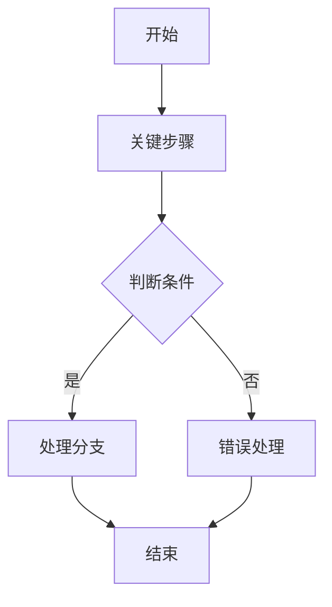

# Course Design Report Guidelines

Use these guidelines when writing `labs/labx/report.md`.

Write in Chinese unless the user or course requires another language. Follow the course-design report structure below. If student number, name, group members, main contributor, or division-of-work information is unknown, keep explicit placeholders such as `<学号>`、`<姓名>`、`<主完成人学号及姓名>`、`<成员分工>` instead of inventing values.

## Personal Experiments 1-2

Use this structure for personal experiments 1 and 2. Match the practical, human-written style of the provided sample: include a clear topic introduction, detailed implementation/debugging narrative, core code excerpts, result analysis, and a substantial improvement/summary section. Do not reduce it to only principle/method/result.

````markdown
# 实验<编号>课程设计报告：<实验题目>

## 一、题目介绍

实验题目：<实验题目>

学号及姓名：<学号> <姓名>

说明实验背景、实验内容、实验目的。可以用条目列出需要掌握的知识点，例如内核编译、系统调用添加、测试方法等。

## 二、实验思路

### 2.1 <子任务或关键流程>

说明总体设计思路。按实验步骤拆分，例如环境准备、源码修改、编译安装、测试验证。

需要描述主要函数接口设计，包括函数名、参数含义、返回值、调用位置和用户态/内核态数据流。

需要说明主要函数的程序设计思路，并用 Mermaid 画流程图：



说明设计方案的创新性：重点写自己相对参考资料、示例代码或同学方案做出的调整，以及这样改的原因、优缺点。

## 三、遇到问题及解决方法

按问题编号记录项目实现过程中遇到的问题、现象、原因和解决方法。可以引用截图位置或图号，但不要伪造截图。

推荐格式：

1. <问题标题>

现象：<错误信息或运行现象>

原因：<分析原因>

解决方法：<具体命令、代码调整或配置调整>

## 四、核心代码及实验结果展示

不需要粘贴所有代码，粘贴核心代码即可。每段代码前说明完整文件路径、修改目的和关键逻辑。

实验结果需要分析运行输出，说明输出如何证明实验成功。若有截图，按“图 4.x <说明>”的格式引用。

## 五、个人实验改进与总结

### 5.1 个人实验改进

分析程序性能和实现优缺点，写清楚可改进点。重点突出自己如何改进、为什么这样改进、改进部分的优缺点。内容应有实质分析，不写空泛套话。

### 5.2 个人实验总结

总结实验收获、对课程设计的理解、实验难度和对教师实验设计的建议。需要回答：实验设计是否合理，难易程度如何，有什么改进建议。

## 六、参考文献

列出阅读书籍、论文、网络资源、课程资料、官方文档、博客、视频或向同学/老师请教的来源。允许写 URL；URL 应尽量完整可访问。

## 七、程序完整代码

个人实验如果代码规模较小，可以贴完整代码；如果代码规模很大，优先贴新增/修改的完整核心文件，并说明未改动的大型文件不全文粘贴。
````

## Group Educoder Experiment 3

Use this structure for group experiment 3, namely the Head Educoder platform experiments 1-17. The whole group submits one combined report, and every small experiment must identify its main contributor. When generating a report for a single Educoder lab, still include the group fields and the small-experiment main-contributor placeholder.

````markdown
# 分组实验3课程设计报告：头歌平台实验1-17

## （1）实验题目

实验题目：<小实验编号与题目>

主完成人：<主完成人学号及姓名>

## （2）小组成员

组长学号及姓名：<组长学号> <组长姓名>

成员学号及姓名：<成员1学号> <成员1姓名>；<成员2学号> <成员2姓名>

## （3）项目设计方案

① 成员分工描述：

<成员分工>

② 本实验总体设计思路：

说明本小实验在操作系统中的目标机制、关键模块、执行路径和总体解决方案。

③ 对设计方案的创新性分析：

说明实现中相对模板、参考资料或常规做法的调整，以及这些调整的原因和效果。

## （4）项目实现过程

① 详细记录项目实现过程中遇到的问题、原因及解决方法：

按问题列出现象、原因、解决方式。可以引用截图位置或图号，但不要伪造截图。

② 分析程序运行结果：

列出本地构建/运行结果、关键输出、官方评测状态，并解释这些结果如何证明实验完成。

③ 分析程序实现中的创新性：

结合实际代码说明实现细节中的改进点。

## （5）对项目的进一步思考

① 分析所实现程序的性能，包括优缺点：

② 考虑的改进思路：

③ 对实验设计的合理性、难易程度和改进建议：

## （6）参考文献

列出课程资料、仓库源码、教材、官方文档、博客、论文、视频等。允许写 URL；URL 应尽量完整可访问。

## （7）程序代码

列出每一个修改过文件的完整文件路径、修改内容，并添加必要注释。Educoder 分组实验不需要粘贴整个未改动工程，重点写清楚所有修改文件和关键代码。
````

## Writing Rules

- Describe the experiment, not the platform automation. Do not mention `educoder-cli`, API paths, cookies, signed headers, temporary SSH passwords, VM gateway plumbing, or save/evaluate implementation details.
- Keep the report technically specific: name edited modules, full modified file paths, important commands, expected behavior, observed behavior, and official evaluation evidence.
- Do not write a minimal checklist report. Each required section must contain enough explanation for a reader to understand the design, implementation process, debugging history, result, reflection, and code changes.
- For program flowcharts, use Mermaid flowcharts in Markdown unless the user asks for images. Keep flowcharts focused on the main function, syscall path, kernel/user control path, or tested algorithm.
- For screenshots mentioned by the user or report template, use figure captions/placeholders such as `图 2.1 内核编译安装流程图` when actual image files are unavailable. Do not claim a screenshot exists unless an image file is present.
- Include command output snippets only when they support the result. Prefer short excerpts over full logs.
- Do not include passwords, session cookies, private keys, temporary SSH passwords, or raw secret repository content.
- The report may include the original token or result value when it is an experiment output, course-required evidence, or useful for documenting the result.
- State the final official evaluation result using stable fields such as pass/fail, score, compile status, and test-set result.
